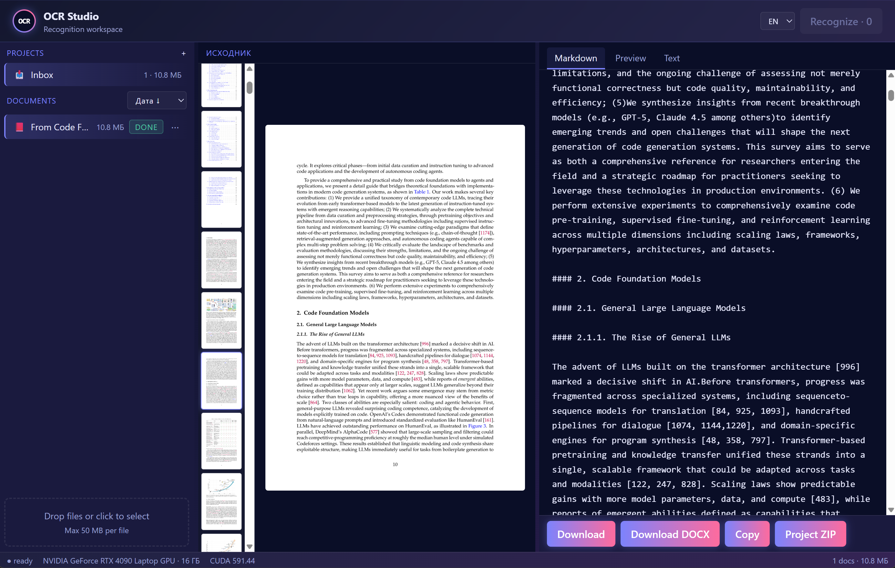
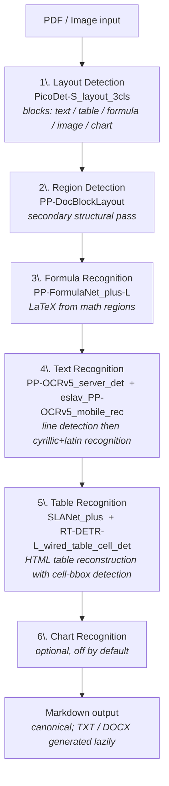

[English](README.md) | [Русский](README.ru.md)

# OCR Studio

Self-hosted document OCR web service powered by PaddleOCR PPStructureV3 — projects, drag-and-drop, real per-page progress, lossless markdown / DOCX export.



## Features

- **Containerized deployment** with GPU passthrough — `docker compose up` ships everything (Python, PaddlePaddle-GPU, models, FastAPI, frontend bundle)
- Recognize PDF + images (PNG, JPG, BMP, TIFF, WEBP) with **tables**, **formulas**, **layout structure**
- Organize documents into projects (CRUD, drag-and-drop between projects, batch ZIP download)
- **Real per-page + per-stage OCR progress** ("page 5/38: text recognition") — not faked
- 3-pane UI with resizable splitters: project sidebar, source preview (PDF/image), result preview
- Output formats: **Markdown** (canonical), **TXT**, **DOCX** with formatting (lists, bold/italic, code, tables)
- Disk-cached PDF preview (low-DPI thumbs all-at-once + lazy full-page on click)
- Bilingual UI (RU/EN) with hot-swap
- SQLite + filesystem persistence with crash recovery

## Models pipeline

OCR Studio uses **PaddleOCR PPStructureV3** for document understanding. The pipeline runs 6 stages per page:



`lang=ru` selects the cyrillic recognition model (`eslav_PP-OCRv5_mobile_rec`) which handles mixed Cyrillic + Latin documents acceptably.

SLANet table column-order fix (cell sort by X-coordinate) is applied in `app/ocr_engine.py:html_table_to_markdown` to work around arbitrary token ordering from the seq2seq table model.

## Key technical decisions

### 4.1. Real per-page OCR progress (not fake)

**Problem**: `engine.predict(file)` is NOT a lazy generator — internally batches all pages, yields them all at once at the end. Naive `for page in engine.predict(...)` shows "0%" for the entire run, then jumps to "100%" — feels frozen.

**Solution** (in `app/ocr_engine.py`): split PDF into single-page temp files via PyMuPDF, loop `engine.predict(single_page.pdf)` per page. Real progress callback fires between pages.

**Trade-off**: ~15% slower than batch (38 pages: 46s vs 40s), but progress is honest.

### 4.2. Per-sub-model stage callbacks

**Problem**: even with per-page split, the user wants to see WHICH model is currently working ("layout" vs "table" vs "text").

**Solution**: monkey-patch `engine.paddlex_pipeline._pipeline.layout_det_model` etc. with a `_Hooked` callable proxy that fires `on_stage_start(name)` before delegating.

**Subtlety**: `engine.paddlex_pipeline` is an `AutoParallelSimpleInferencePipeline` wrapper that proxies attribute READS via `__getattr__` but doesn't propagate `setattr`. Hooks must be installed on the **inner** `_pipeline` (single-device) or `_pipelines[*]` (multi-device), not the wrapper. See `app/ocr_engine.py:install_stage_hooks`.

### 4.3. Hybrid PDF preview cache

**Problem**: rendering 304 PDF pages at full resolution per request is prohibitive. Naive base64-in-JSON for all pages bloats payload to 100+ MB.

**Solution**:
- **Thumbnails** (88px strip, DPI=80): batch render once, cache as `data/docs/{id}/preview/thumb_NNN.jpg`. Subsequent loads from disk are instant.
- **Full-resolution page** (DPI=200): rendered lazily on click, cached as `data/docs/{id}/preview/page_NNN.jpg`. Browser downloads via `` with `Cache-Control: max-age=3600`.

Cache lives under the doc dir and is cleaned automatically on `delete_doc_dir`.

### 4.4. DOCX with real formatting (no pandoc)

**Problem**: PaddleOCR returns markdown. Original `md_to_docx` was a 40-line custom parser supporting only headings + tables — DOCX rendered everything else as plain text.

**Solution**: `markdown` library → HTML → BeautifulSoup walker → python-docx. Supports headings, paragraphs, ordered/unordered lists, inline `<strong>/<em>/<code>`, links, code blocks, blockquotes, tables. No `pandoc` dependency. See `app/converters.py`.

### 4.5. Lazy generation of TXT/DOCX

**Problem**: storing all 3 output formats per doc wastes disk; not all users need all formats.

**Solution**: only `result.md` is saved by the worker (canonical source). On the first request to `/api/result/{id}?format=txt|docx`, the server lazily generates from md and caches the produced file. Subsequent requests serve from disk.

### 4.6. Crash recovery + orphan cleanup

**Problem**: server crash mid-OCR leaves docs in `processing` status forever; user-deletes during OCR can leave files on disk.

**Solution**:
- On startup: `recover_processing()` flips all `processing` → `queued` so the worker re-picks them up.
- Hourly background task `run_orphan_cleanup()`: deletes FS dirs without DB rows, marks DB rows without files as `error`.

### 4.7. SQLite migrations as immutable + idempotent steps

**Problem**: SQLite doesn't support `ALTER TABLE ADD CONSTRAINT`. v2 migration needs to add a CHECK constraint on `created_at`.

**Solution**: each `_migrate_to_vN(conn)` is rebuild-safe (drops zombie temp tables on re-run, full BEGIN/COMMIT transaction, FK temporarily off, integrity check before commit). Schema version persisted in `schema_version` table; `init()` applies missing migrations idempotently.

## Architecture

### Backend (`app/`)

| Module | Responsibility |
|---|---|
| `db.py` | SQLite schema + 4 versioned migrations |
| `storage.py` | `ProjectRepo`, `DocumentRepo` (no SQL outside) |
| `files.py` | FS layout: `data/docs/{id}/{original.*, result.*, preview/*.jpg}` |
| `ocr_engine.py` | PPStructureV3 wrapper, per-page split, stage hooks, table column-order fix |
| `preview_render.py` | Lazy disk-cached preview (thumbs + full pages) with progress |
| `converters.py` | md → txt, md → docx (HTML walker) |
| `preview.py` | md/docx → HTML, sanitization via `bleach` |
| `system.py` | Environment info (`nvidia-smi` parsing) |
| `main.py` | FastAPI routes, async worker, lifespan, batch ZIP |

### Frontend (`app/static/src/`)

Vite + TypeScript strict + Tailwind.

| Module | Responsibility |
|---|---|
| `main.ts` | Entry, polling, wiring |
| `api.ts` | Typed fetch client |
| `state.ts` | localStorage (uiLang, panelSizes, sortMode, activeProjectId) |
| `i18n.ts` + `i18n/{ru,en}.json` | Hot-swap RU/EN |
| `types.ts` | Shared API types |
| `projects.ts`, `documents.ts` | Sidebar |
| `source.ts` | PDF/image preview pane |
| `preview.ts` | Result pane (3 tabs: Markdown / Preview / TXT) |
| `statusbar.ts` | Engine + env + project stats |
| `modal.ts`, `toast.ts`, `menu.ts` | UI primitives |
| `splitter.ts` | Resizable panes |
| `drag.ts`, `polling.ts`, `clipboard.ts`, `validation.ts`, `icons.ts` | Utilities |

## Quick start

```bash
# Backend deps
pip install -r requirements.txt

# Frontend build
npm install
npm run build

# Run
uvicorn app.main:app --host 0.0.0.0 --port 8100
```

Open `http://localhost:8100`. Data persists under `./data/`.

**Frontend dev with HMR:**

```bash
npm run dev               # http://localhost:5173 (proxies /api → 8100)
uvicorn app.main:app --port 8100
```

## Container deployment & GPU requirements

The recommended deployment is a **Docker container with GPU passthrough**. The container bundles Python 3.10, PaddlePaddle-GPU, PaddleOCR pipelines (~3 GB models cached on first start) and the FastAPI server. Frontend bundle is built at image build time.

### Hardware requirements

- **NVIDIA GPU** with CUDA compute capability **6.0+** (Pascal generation or newer; Volta/Turing/Ampere/Ada all supported)
- **VRAM: 8 GB minimum**, 12 GB+ recommended for documents with many tables/formulas (full pipeline keeps 5 models resident in GPU memory)
- **NVIDIA driver ≥ 525.x** (compatible with CUDA 12.6)
- **NVIDIA Container Toolkit** installed on the host — required for `docker compose` to expose the GPU; without it `docker compose up` fails on the GPU reservation step

### CPU-only fallback

PaddlePaddle ships a CPU build, but PPStructureV3 inference on CPU is **10-30× slower** for typical documents — not recommended for production use. Replace `paddlepaddle-gpu` with `paddlepaddle` in `requirements.txt` and rebuild if you need this.

### Persistent data

`docker-compose.yml` mounts `./data/` as a bind-volume. SQLite DB (`data/data.db`), uploaded originals, OCR results and preview cache (`data/docs/<doc_id>/`) survive `docker compose down` / image rebuilds.

### Watch-folder (unattended batch processing)

Drop files into `./watch/inbox/` (subdirectories are supported; the source tree is mirrored in the output).
The container picks them up automatically and writes Markdown results to `./watch/out/` preserving the
relative path (e.g. `inbox/scans/2024/report.pdf` → `out/scans/2024/report.md`).
After processing, source files are moved to `./watch/inbox/processed/` on success or to
`./watch/inbox/errors/` with a `<file>.error.txt` sidecar on failure.
All watch-folder documents appear in a dedicated **Watch** project in the UI; OCR language is fixed to Russian.
Create the `watch/` directory on the host before the first `docker compose up` so the bind mount succeeds:

```bash
mkdir -p watch/inbox watch/out
```

Optional environment variables (defaults in `docker-compose.yml`):

- `WATCH_INTERVAL` — poll cycle in seconds (default `5.0`).
- `WATCH_STABLE_SECS` — minimum time a file's `(mtime, size)` must stay unchanged before ingest, to avoid grabbing partially-written files (default `3`).
- `OCR_MAX_FILE_MB` — maximum source file size in MB for both uploads and watcher ingest (default `50`, the current stand ships `200`). The file is read into memory in full, so pick a value your host RAM can absorb. Oversized watcher files are still recorded as `status='error'` and moved to `inbox/errors/` with a sidecar — they are never processed.

Re-OCR of a watch-folder document (via the UI gear menu) still works: the original is preserved inside `data/docs/<doc_id>/`, independent of `/watch/`. The new result is written next to the previous one as `<name>_1.md` (collision suffix); the source remains in `processed/` and is not moved again.

#### Live queue progress in the footer

While documents are being processed (whether from `watch/inbox/` or manual uploads), the status bar at the bottom of the UI shows live progress: a progress bar, `M / N` counter, current queue size, elapsed time, and an ETA. The footer adds a second row only when the queue is active; in idle mode it shows just `last batch: <count> · <duration>` appended to the existing engine/env line. Progress is recalculated whenever the frontend polls (every 2s while a batch is running, every 10s when idle) — no recalculation happens if the tab is in the background and polling is paused by the browser.

### Run

```bash
mkdir -p data       # avoid root-owned dir if it doesn't exist yet
docker compose up --build
```

The first start downloads ~3 GB of PaddleOCR model weights from `paddleocr.bj.bcebos.com` into the container's user cache (mapped to host); subsequent starts are instant.

Open `http://localhost:8100`.

## API

| Method + Path | Purpose |
|---|---|
| `GET /` | UI |
| `POST /api/ocr` | Upload files (queued, no auto-OCR). Form: `files[]`, `project_id` |
| `POST /api/recognize?project_id=N` | Start OCR for queued docs in project |
| `GET /api/status?project_id=N` | Doc list with progress (status, stage, stage_label, current_page/page_count) |
| `GET /api/projects` etc. | Projects CRUD |
| `PATCH /api/documents/{id}` | Move between projects |
| `DELETE /api/documents/{id}` | Delete (409 if processing) |
| `GET /api/result/{id}?format=md\|txt\|docx` | Download result (lazy gen) |
| `GET /api/markdown/{id}?format=md\|txt` | Plain text |
| `GET /api/rendered/{id}?format=md\|docx` | Sanitized HTML |
| `GET /api/preview/{id}/info` | `{count, kind, thumbs_progress}` |
| `GET /api/preview/{id}/thumbs` | All thumbnails as base64-JSON |
| `GET /api/preview/{id}/page/{n}` | Full-res page JPEG (browser-cached) |
| `GET /api/source/{id}` | Original file |
| `GET /api/projects/{id}/zip` | Batch ZIP of completed docs |
| `GET /api/system` | GPU/CUDA/VRAM, engine status, pipeline models list |
| `GET /api/limits` | Max file size, allowed extensions |

## Tests

```bash
pytest                # backend (~180 tests)
npm test              # frontend (vitest + jsdom, ~155 tests)
npm run build         # type-check + production bundle
```

## License

Apache 2.0 (inherited from PaddleOCR).
