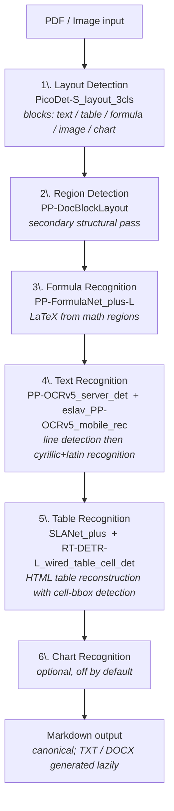

[English](README.md) | [Русский](README.ru.md)

# OCR Studio

Самостоятельно развёртываемый веб-сервис распознавания документов на базе PaddleOCR PPStructureV3 — проекты, drag-and-drop, реальный постраничный прогресс, экспорт в markdown / DOCX без потерь.


## Возможности

- **Контейнерное развёртывание** с прокидыванием GPU — `docker compose up` поднимает всё (Python, PaddlePaddle-GPU, модели, FastAPI, frontend-бандл)
- Распознавание PDF + изображений (PNG, JPG, BMP, TIFF, WEBP) с поддержкой **таблиц**, **формул**, **структуры макета**
- Организация документов по проектам (CRUD, drag-and-drop между проектами, пакетное скачивание ZIP)
- **Реальный постраничный + поэтапный прогресс OCR** ("страница 5/38: распознавание текста") — не симуляция
- Трёхпанельный UI с изменяемыми разделителями: боковая панель проектов, предпросмотр исходника (PDF/изображение), предпросмотр результата
- Форматы вывода: **Markdown** (канонический), **TXT**, **DOCX** с форматированием (списки, жирный/курсив, код, таблицы)
- Дисковый кэш предпросмотра PDF (низкоDPI миниатюры — сразу все, полная страница — лениво по клику)
- Двуязычный UI (RU/EN) с горячим переключением
- SQLite + файловая система с восстановлением после сбоев

## Конвейер моделей

OCR Studio использует **PaddleOCR PPStructureV3** для анализа документов. Конвейер выполняет 6 этапов на каждую страницу:



`lang=ru` выбирает кириллическую модель распознавания (`eslav_PP-OCRv5_mobile_rec`), которая приемлемо справляется со смешанными кирилло-латинскими документами.

Исправление порядка столбцов таблиц SLANet (сортировка ячеек по X-координате) применяется в `app/ocr_engine.py:html_table_to_markdown`, чтобы обойти произвольный порядок токенов seq2seq-модели.

## Ключевые технические решения

### 4.1. Реальный постраничный прогресс OCR (не симуляция)

**Проблема**: `engine.predict(file)` НЕ является ленивым генератором — внутри он обрабатывает все страницы батчем и отдаёт их разом в конце. Наивный `for page in engine.predict(...)` показывает "0%" всё время обработки, затем резкий скачок до "100%" — ощущение зависания.

**Решение** (в `app/ocr_engine.py`): PDF разбивается на однострaничные временные файлы через PyMuPDF, затем `engine.predict(single_page.pdf)` вызывается для каждой страницы. Коллбэк прогресса срабатывает между страницами.

**Компромисс**: ~15% медленнее батча (38 страниц: 46с против 40с), но прогресс честный.

### 4.2. Поэтапные коллбэки по подмоделям

**Проблема**: даже при постраничном разбиении пользователь хочет видеть, КАКАЯ модель сейчас работает ("макет" или "таблицы" или "текст").

**Решение**: monkey-patch `engine.paddlex_pipeline._pipeline.layout_det_model` и аналогичных атрибутов с помощью `_Hooked` — callable-прокси, вызывающего `on_stage_start(name)` перед делегированием.

**Тонкость**: `engine.paddlex_pipeline` — это обёртка `AutoParallelSimpleInferencePipeline`, которая проксирует ЧТЕНИЕ атрибутов через `__getattr__`, но не пробрасывает `setattr`. Хуки нужно устанавливать на **внутренний** `_pipeline` (один девайс) или `_pipelines[*]` (несколько девайсов), а не на обёртку. Подробнее: `app/ocr_engine.py:install_stage_hooks`.

### 4.3. Гибридный кэш предпросмотра PDF

**Проблема**: рендеринг 304 страниц PDF в полном разрешении на каждый запрос недопустимо затратен. Наивный base64-в-JSON для всех страниц раздувает ответ до 100+ МБ.

**Решение**:
- **Миниатюры** (88px, DPI=80): рендерятся разово, кэшируются как `data/docs/{id}/preview/thumb_NNN.jpg`. Последующие загрузки с диска мгновенны.
- **Полноразмерная страница** (DPI=200): рендерится лениво по клику, кэшируется как `data/docs/{id}/preview/page_NNN.jpg`. Браузер получает через `` с `Cache-Control: max-age=3600`.

Кэш живёт внутри директории документа и автоматически удаляется при `delete_doc_dir`.

### 4.4. DOCX с реальным форматированием (без pandoc)

**Проблема**: PaddleOCR возвращает markdown. Исходный `md_to_docx` был 40-строчным парсером с поддержкой только заголовков и таблиц — всё остальное в DOCX рендерилось как простой текст.

**Решение**: библиотека `markdown` → HTML → обход через BeautifulSoup → python-docx. Поддерживаются заголовки, абзацы, нумерованные/маркированные списки, инлайн `<strong>/<em>/<code>`, ссылки, блоки кода, цитаты, таблицы. Зависимость от `pandoc` отсутствует. Подробнее: `app/converters.py`.

### 4.5. Ленивая генерация TXT/DOCX

**Проблема**: хранить все 3 формата вывода на документ расточительно; не всем пользователям нужны все форматы.

**Решение**: воркер сохраняет только `result.md` (канонический источник). При первом запросе к `/api/result/{id}?format=txt|docx` сервер лениво генерирует файл из md и кэширует его. Последующие запросы отдаются с диска.

### 4.6. Восстановление после сбоев + очистка сирот

**Проблема**: сбой сервера в процессе OCR оставляет документы в статусе `processing` навсегда; удаление пользователем в процессе OCR может оставить файлы на диске.

**Решение**:
- При старте: `recover_processing()` переключает все `processing` → `queued`, чтобы воркер повторно взял их в работу.
- Фоновая задача раз в час `run_orphan_cleanup()`: удаляет директории на ФС без записей в БД, помечает записи в БД без файлов как `error`.

### 4.7. Миграции SQLite — неизменяемые и идемпотентные шаги

**Проблема**: SQLite не поддерживает `ALTER TABLE ADD CONSTRAINT`. Миграция v2 должна добавить CHECK-ограничение на `created_at`.

**Решение**: каждая `_migrate_to_vN(conn)` безопасна для повторного запуска (удаляет временные таблицы-зомби при перезапуске, полная транзакция BEGIN/COMMIT, FK временно отключены, проверка целостности перед коммитом). Версия схемы хранится в таблице `schema_version`; `init()` применяет пропущенные миграции идемпотентно.

## Архитектура

### Бэкенд (`app/`)

| Модуль | Ответственность |
|---|---|
| `db.py` | SQLite-схема + 4 версионные миграции |
| `storage.py` | `ProjectRepo`, `DocumentRepo` (SQL только внутри) |
| `files.py` | Структура ФС: `data/docs/{id}/{original.*, result.*, preview/*.jpg}` |
| `ocr_engine.py` | Обёртка PPStructureV3, постраничный разбиение, хуки этапов, исправление порядка столбцов |
| `preview_render.py` | Ленивый дисковый кэш предпросмотра (миниатюры + полные страницы) с прогрессом |
| `converters.py` | md → txt, md → docx (обход HTML) |
| `preview.py` | md/docx → HTML, санитизация через `bleach` |
| `system.py` | Информация о среде (парсинг `nvidia-smi`) |
| `main.py` | Маршруты FastAPI, асинхронный воркер, lifespan, пакетный ZIP |

### Фронтенд (`app/static/src/`)

Vite + TypeScript strict + Tailwind.

| Модуль | Ответственность |
|---|---|
| `main.ts` | Точка входа, поллинг, связывание |
| `api.ts` | Типизированный fetch-клиент |
| `state.ts` | localStorage (uiLang, panelSizes, sortMode, activeProjectId) |
| `i18n.ts` + `i18n/{ru,en}.json` | Горячее переключение RU/EN |
| `types.ts` | Общие API-типы |
| `projects.ts`, `documents.ts` | Боковая панель |
| `source.ts` | Панель предпросмотра PDF/изображения |
| `preview.ts` | Панель результата (3 вкладки: Markdown / Предпросмотр / TXT) |
| `statusbar.ts` | Статус движка, среда, статистика проекта |
| `modal.ts`, `toast.ts`, `menu.ts` | UI-примитивы |
| `splitter.ts` | Изменяемые панели |
| `drag.ts`, `polling.ts`, `clipboard.ts`, `validation.ts`, `icons.ts` | Утилиты |

## Быстрый старт

```bash
# Зависимости бэкенда
pip install -r requirements.txt

# Сборка фронтенда
npm install
npm run build

# Запуск
uvicorn app.main:app --host 0.0.0.0 --port 8100
```

Откройте `http://localhost:8100`. Данные хранятся в `./data/`.

**Фронтенд dev с HMR:**

```bash
npm run dev               # http://localhost:5173 (проксирует /api → 8100)
uvicorn app.main:app --port 8100
```

## Контейнерное развёртывание и требования к GPU

Рекомендуемый способ запуска — **Docker-контейнер с прокидыванием GPU**. Контейнер содержит Python 3.10, PaddlePaddle-GPU, пайплайны PaddleOCR (~3 ГБ моделей кэшируются при первом запуске) и FastAPI-сервер. Frontend-бандл собирается на этапе сборки образа.

### Требования к железу

- **NVIDIA GPU** с CUDA compute capability **6.0+** (поколение Pascal или новее; Volta/Turing/Ampere/Ada все подходят)
- **VRAM: минимум 8 ГБ**, рекомендуется 12 ГБ+ для документов с большим количеством таблиц/формул (полный пайплайн держит 5 моделей в GPU-памяти)
- **NVIDIA-драйвер ≥ 525.x** (совместимый с CUDA 12.6)
- **NVIDIA Container Toolkit** установлен на хосте — без него `docker compose up` упадёт на этапе резервирования GPU

### CPU-fallback

PaddlePaddle поставляется и в CPU-сборке, но inference PPStructureV3 на CPU **в 10-30 раз медленнее** для типичных документов — не рекомендуется для продакшна. Если нужно — заменить `paddlepaddle-gpu` на `paddlepaddle` в `requirements.txt` и пересобрать.

### Постоянное хранение

`docker-compose.yml` монтирует `./data/` как bind-volume. SQLite-база (`data/data.db`), исходники документов, результаты OCR и preview-кэш (`data/docs/<doc_id>/`) переживают `docker compose down` и пересборку образа.

### Watch-папка (пакетная обработка без участия пользователя)

Положите файлы в `./watch/inbox/` (поддиректории поддерживаются; структура папок зеркалируется в выводе).
Контейнер подхватывает их автоматически и записывает результаты в Markdown в `./watch/out/`,
сохраняя относительный путь (например, `inbox/scans/2024/report.pdf` → `out/scans/2024/report.md`).
После обработки исходные файлы перемещаются в `./watch/inbox/processed/` при успехе или в
`./watch/inbox/errors/` с сопроводительным файлом `<file>.error.txt` при ошибке.
Все документы из watch-папки отображаются в отдельном проекте **Watch** в UI; язык OCR зафиксирован как русский.
Создайте директорию `watch/` на хосте до первого `docker compose up`, чтобы bind-монтирование сработало:

```bash
mkdir -p watch/inbox watch/out
```

Две опциональные переменные окружения настраивают watcher (значения по умолчанию в `docker-compose.yml`):

- `WATCH_INTERVAL` — период опроса в секундах (по умолчанию `5.0`).
- `WATCH_STABLE_SECS` — минимальное время, в течение которого `(mtime, size)` файла должен оставаться неизменным перед ингестом, чтобы не подхватывать частично записанные файлы (по умолчанию `3`).

Повторный OCR (Re-OCR) watch-документа через шестерёнку в UI работает: оригинал хранится в `data/docs/<doc_id>/` независимо от `/watch/`. Новый результат пишется рядом с предыдущим как `<имя>_1.md` (суффикс коллизии); исходник остаётся в `processed/` и второй раз не перемещается.

#### Прогресс очереди в подвале

Пока документы обрабатываются (хоть из `watch/inbox/`, хоть после ручной загрузки), внизу UI отображается живой прогресс: progress bar, счётчик `M / N`, текущий размер очереди, прошедшее время и ETA. Подвал показывает дополнительную строку только когда очередь активна; в idle режиме к существующей строке engine/env добавляется хвост `последний батч: <count> · <duration>`. Прогресс пересчитывается на каждом poll'е фронта (каждые 2s пока идёт батч, каждые 10s в idle) — если вкладка в фоне и polling приостановлен браузером, пересчёта не будет.

### Запуск

```bash
mkdir -p data       # чтобы Docker не создал директорию с root-владельцем
docker compose up --build
```

Первый запуск скачивает ~3 ГБ весов моделей PaddleOCR с `paddleocr.bj.bcebos.com` в пользовательский кэш контейнера (примонтированный к хосту); последующие запуски мгновенные.

Открыть `http://localhost:8100`.

## API

| Метод + Путь | Назначение |
|---|---|
| `GET /` | UI |
| `POST /api/ocr` | Загрузка файлов (в очередь, без авто-OCR). Form: `files[]`, `project_id` |
| `POST /api/recognize?project_id=N` | Запуск OCR для документов в очереди проекта |
| `GET /api/status?project_id=N` | Список документов с прогрессом (status, stage, stage_label, current_page/page_count) |
| `GET /api/projects` и др. | CRUD проектов |
| `PATCH /api/documents/{id}` | Перемещение между проектами |
| `DELETE /api/documents/{id}` | Удаление (409 если в обработке) |
| `GET /api/result/{id}?format=md\|txt\|docx` | Скачать результат (ленивая генерация) |
| `GET /api/markdown/{id}?format=md\|txt` | Простой текст |
| `GET /api/rendered/{id}?format=md\|docx` | Санитизированный HTML |
| `GET /api/preview/{id}/info` | `{count, kind, thumbs_progress}` |
| `GET /api/preview/{id}/thumbs` | Все миниатюры как base64-JSON |
| `GET /api/preview/{id}/page/{n}` | Полноразмерная страница JPEG (кэшируется браузером) |
| `GET /api/source/{id}` | Исходный файл |
| `GET /api/projects/{id}/zip` | Пакетный ZIP завершённых документов |
| `GET /api/system` | GPU/CUDA/VRAM, статус движка, список моделей конвейера |
| `GET /api/limits` | Максимальный размер файла, разрешённые расширения |

## Тесты

```bash
pytest                # бэкенд (~180 тестов)
npm test              # фронтенд (vitest + jsdom, ~155 тестов)
npm run build         # проверка типов + production-сборка
```

## Лицензия

Apache 2.0 (унаследовано от PaddleOCR).
